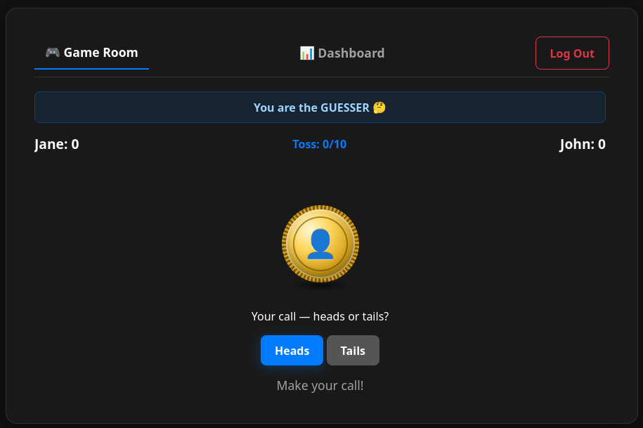
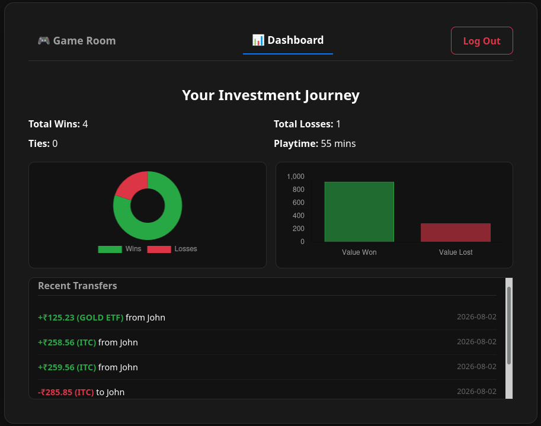

# 🪙 Provably Fair Coin Flip & Investment Tracker

A self-hosted, real-time multiplayer coin-flipping game designed to settle bets through financial investments rather than gambling. Built with a cryptographically secure backend, persistent data tracking, and a dynamic "glassmorphism" dashboard.

## 📸 Screenshots

> *The real-time synchronized Game Room featuring a 3D CSS coin animation.*


> *The Player Dashboard tracking Win/Loss ratios and lifetime investment transfers.*

---

## 📖 User Manual & Game Rules

This isn't your standard coin flip. This game is designed to build wealth by forcing the loser to invest in the winner.

### The Objective
Two players join a synchronized room. The first player to reach **6 Wins** (Best of 10) wins the game.

### The Roles
To ensure fairness, gameplay is broken into a two-step handshake process:
1. **The Guesser (🤔):** One player is randomly assigned to call the toss (Heads or Tails).
2. **The Flipper (🪙):** The second player must wait for the guess to be locked in before they can physically initiate the coin flip.

### The Resolution Phase (Paying Up!)
When a player reaches 6 wins, the game freezes and enters the **Resolution Phase**.
* **The Loser** is locked on a screen where they must input a Stock Ticker (e.g., `RELIANCE`, `ITC`) and a Monetary Amount (₹).
* **The Winner** waits until the Loser confirms they have purchased and transferred the stock asset to them.
* Once the loser commits the transaction, the game records the wealth transfer to the database, updates both players' dashboards, and unlocks the room for a new game.

---

## 🚀 Quick Start (Installation & Hosting)

This application is fully containerized and uses Cloudflare Quick Tunnels to securely expose the game to the public internet without requiring port forwarding or a custom domain.

### Prerequisites
* [Docker](https://www.docker.com/) and Docker Compose installed on your host machine.
* *(Optional)* Portainer for visual container management.

### Deployment Instructions

**1. Clone the repository and build the container:**
```bash
git clone [https://github.com/Code-geass21/my-fair-coinflip]
cd my-fair-coinflip
docker build -t my-fair-coinflip:latest .
```
